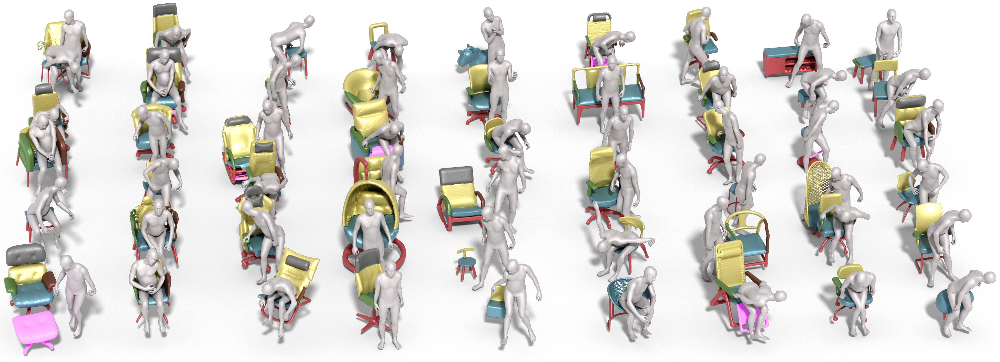

# Full-Body Articulated Human-Object Interaction

<p align="center"></p></br>

This is the code repository of **Full-Body Articulated Human-Object Interaction** - [pdf](https://arxiv.org/pdf/2212.10621.pdf) - [arxiv](http://arxiv.org/abs/2212.10621) - [project](https://jnnan.github.io/project/chairs) -


# Environment
We tested our code with CUDA 11.1, PyTorch 1.11.0, and torchvision 0.10.0. 

After installing CUDA, PyTorch and torchvision, run the following command for installing other dependencies:
```shell
pip install -r requirements.txt
```

# Data Preparation
Please download the sample data and weights from [this google drive link](https://drive.google.com/file/d/1ZfrfMWIVK_vh-3SbV1TswPje9VGENiNI/view?usp=sharing) and extract the zip file to the root directory of this repository.

You need to download the SMPL-X models from [here](https://smpl-x.is.tue.mpg.de/download.php) and unzip them to `Data/body_models/smplx/`.

Your directory should look like this: 

```
├─ Data
    ├─ AHOI_ROOT
        ├─ Meshes_wt
        ├─ Metas
        ├─ object_part_voxel_64
    ├─ DATA_FOLDER
    ├─ IMG_FOLDER
        ├─ 0001
            ├─ 1
                ├─ 0000.png
                ├─ 0005.png
                ├─ 0010.png
                    ...
            ├─ 2
            ├─ 3
            ├─ 4
        ├─ 0002
            ...
    ├─ body_models
        ├─ smplx
    ├─ checkpoint
├─ ahoi_utils.py
├─ dataloaders.py
    ...
```


# Code

## Reconstruction
### Training the reconstruction model
Run the following commands for training:
```shell
python train_voxel_pred.py
```
After the training is finished, the weight file will be stored in `./checkpoints/model_voxel_pred.pth`.
### Testing the reconstruction model
Run the following commands to extract mesh result:
```shell
python test_voxel_pred.py 
```

## HOI Prior

### Training the HOI prior model
The HOI Prior is the model for optimizing the part-level 6D pose of the articulated object under kinematics constraints. Run the following commands for training HOI prior:
```shell
python train_contrast_voxel_vae.py
```
After the training is finished, the weight file will be stored in `./checkpoints/cvae.pth`.

### Optimization

After training both the reconstruction model and the HOI prior model, optimize the object pose with `python optimize_cvae_part.py`. 

Run the following commands for evaluation:
```shell
python optimize_cvae_part.py
```

Here we clarify the parameters in configuration.

- `save_image`: Whether or not to save visualization of optimization process in gif.
- `n_step`: the number of step in optimization.
- `output_dir`: The save path of visualization outcomes.
- `n_grid`: The resolution of voxelized object and human. The only resolution we support now is 64 (default value).
- `lr`: the speed of gradient descent in optimization.
- `prior_hidden`: the length of the hidden vector in HOI prior model.
- `recon_hidden`: the length of the hidden vector in reconstruction model.


